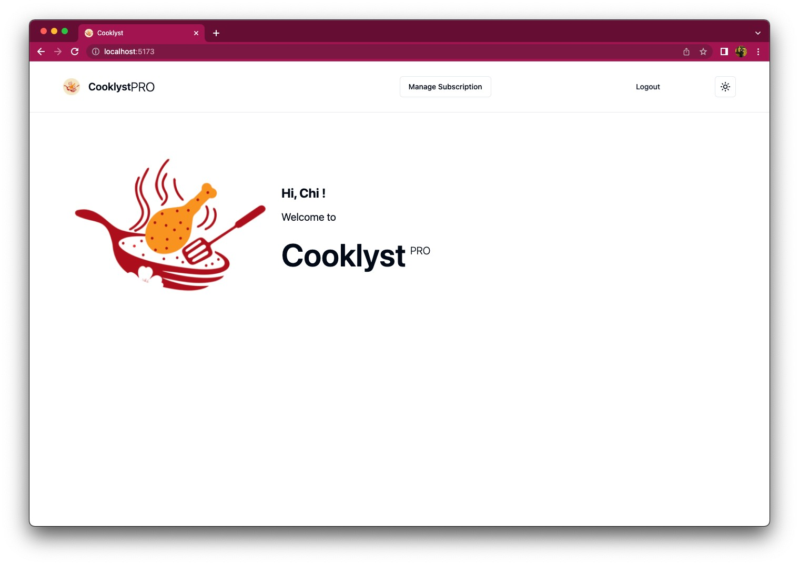
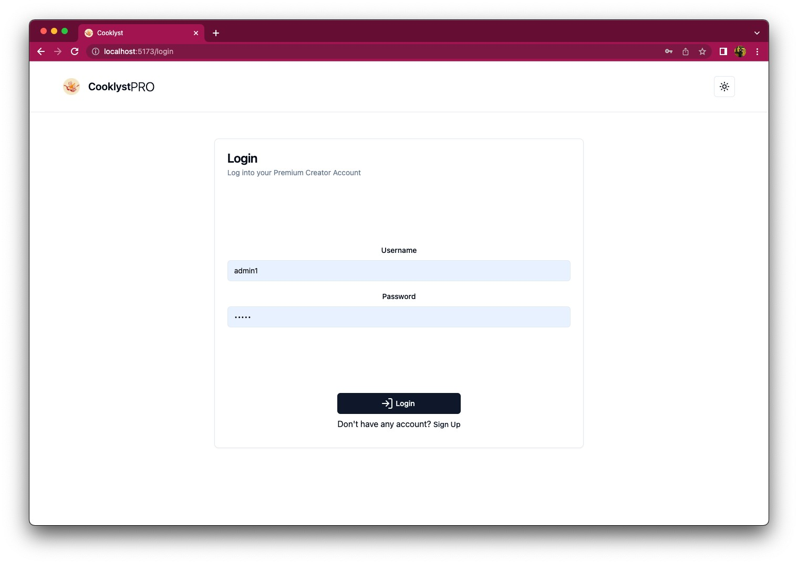
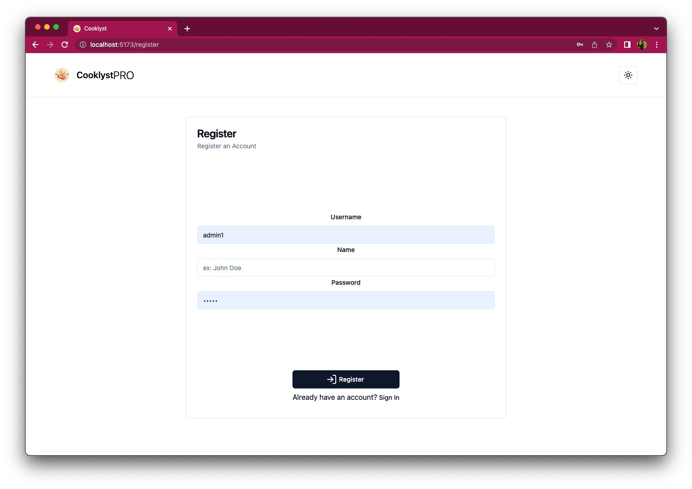
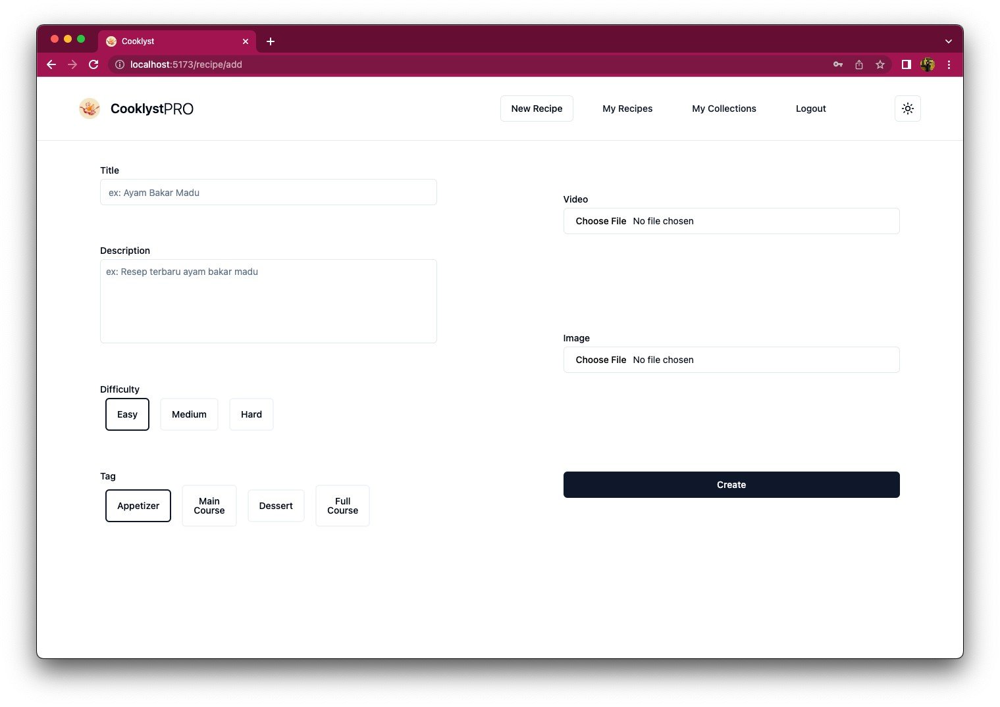
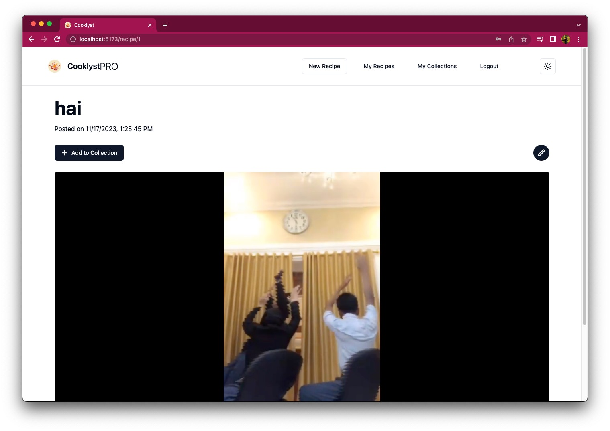
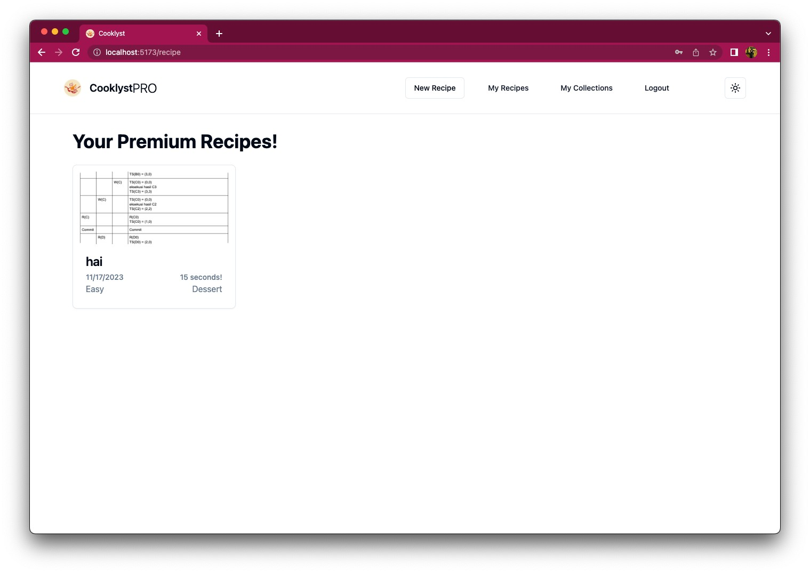
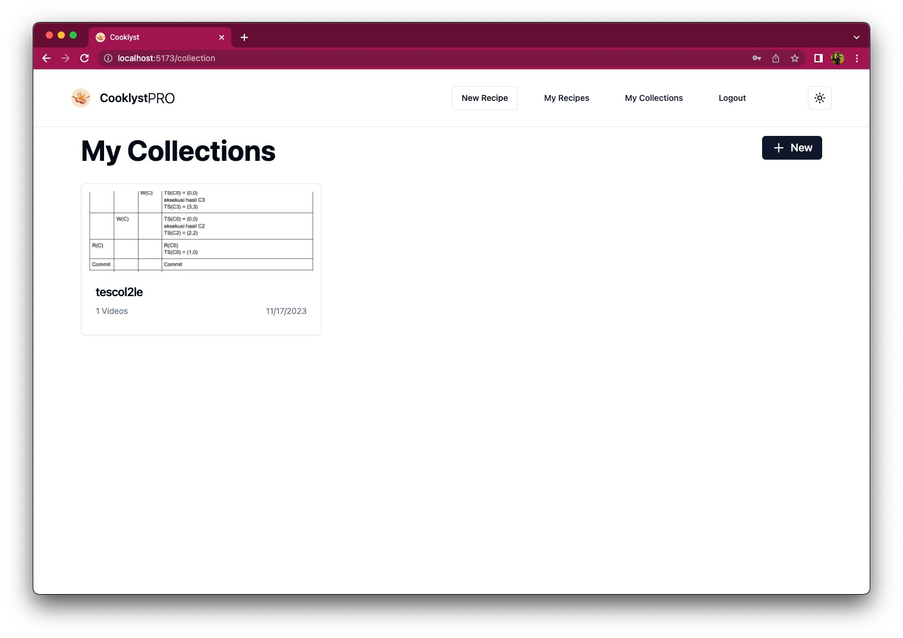
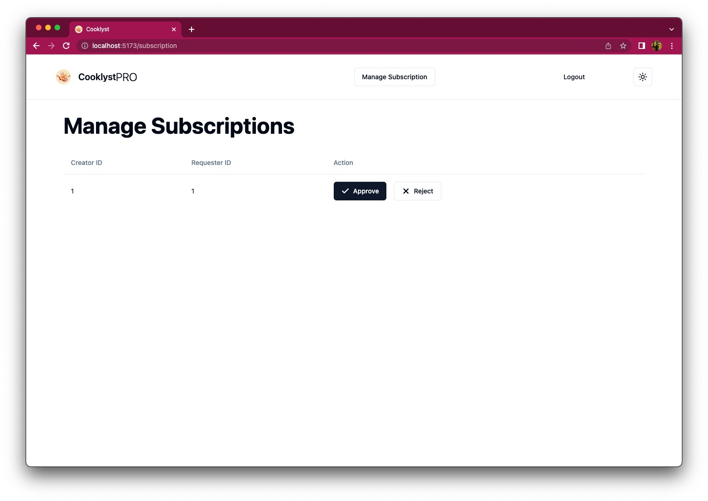

# Cooklyst - Who let them cook?
> Tugas Milestone 2 IF3110 Web-based Application Development - Client Single Page Application (ReactJS)

## Deskripsi
Sebuah aplikasi yang dibangun menggunakan ReactJS sebagai platform bagi creator dan admin untuk membuat dan mengedit resep premium

## Screen

### Home Page  (/)

### Login Page  (/login)

### Register Page  (/login)

### Add Recipe Page  (/recipe/add)

### Edit Recipe Page  (/recipe/:id/edit)

## View Recipe Page (/recipe/:id)

### My Recipe Page  (/recipe)

### My Collection Page  (/collection)

### Subscriptions List Page (/subscriptions)

## Pembagian Tugas